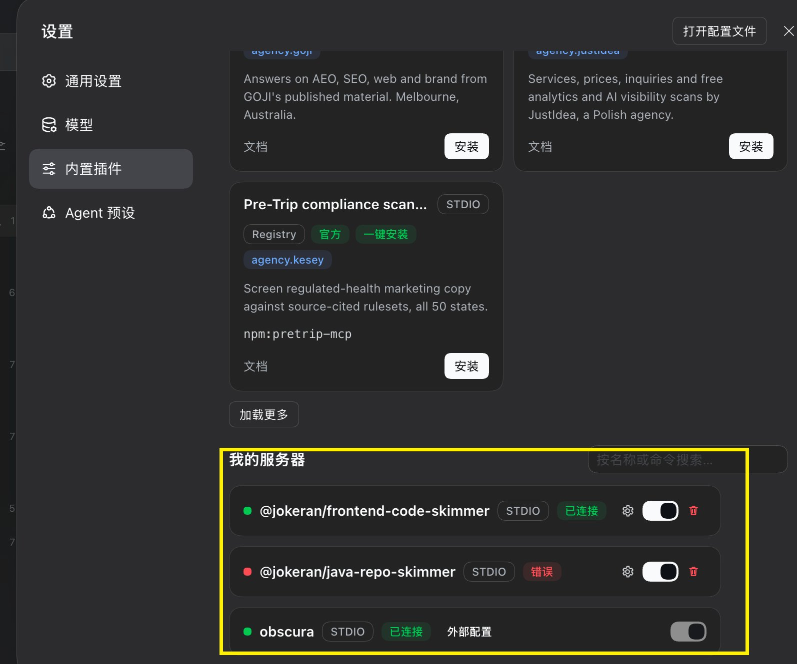
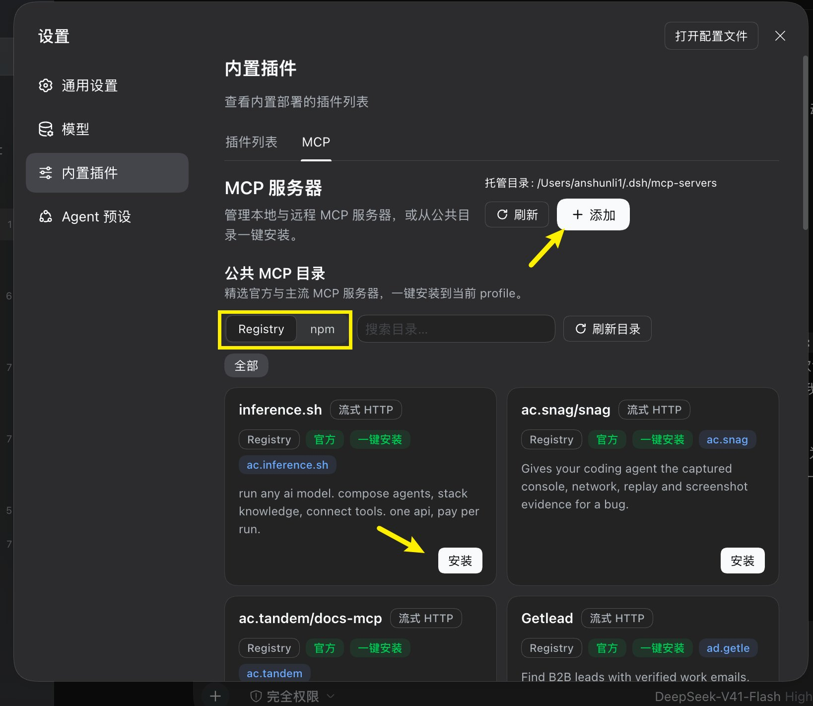
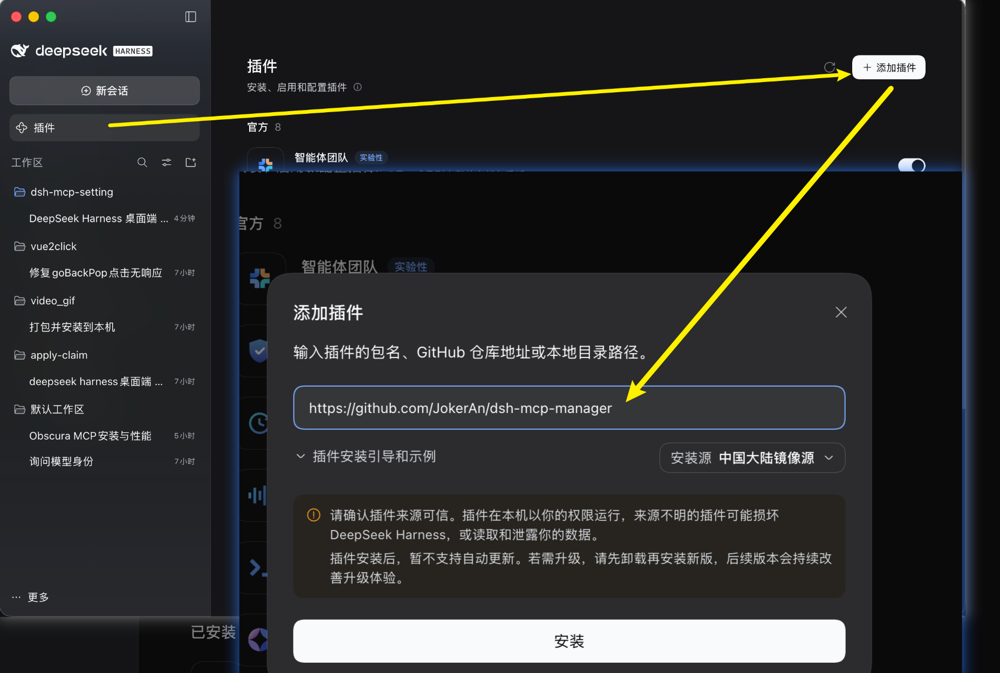
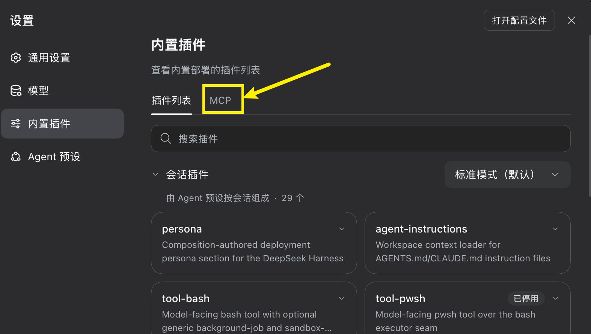
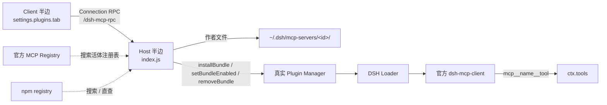

# dsh-mcp-manager

**DeepSeek Harness（DSH）的 MCP 总管理器** —— 一个页面管好你所有的 MCP 服务器。

装 MCP、找 MCP、开关 MCP、改 MCP 参数，全在 **设置 → 内置插件 → MCP** 一个标签页里完成，不用再手写 `cordis.patch.yml`。

[](https://github.com/topics/dsh-plugin)
[](LICENSE)

| 你想做的事 | 在这里怎么做 |
|---|---|
| **装一个 MCP** | 公共目录里搜一下，点卡片上的「安装」 |
| **装 npm 上的 MCP** | 输入 `@scope/包名`，卡片会从包的 `bin` 自动推导启动命令 |
| **找 MCP** | 直接搜官方 MCP Registry 与 npm，可翻页、可刷新 |
| **开关 / 改参数 / 删除** | 卡片上的开关、齿轮、垃圾桶；改完保存即生效 |
| **接自己的私有 MCP** | 「+ 添加」，填 stdio 或 流式 HTTP 即可 |

装好的服务器，其工具会立刻以 `mcp__<名称>__<工具>` 注册给模型，**无需重启**。

**目录** · [30 秒安装](#30-秒安装) · [为什么需要它](#为什么需要它) · [特性](#特性) · [安装](#安装) · [使用](#使用) · [工作原理](#工作原理) · [开发](#开发) · [已知限制](#已知限制)

### 30 秒安装

在 DSH 的 **插件** 页面点 **+ 添加插件**，粘贴这一行，点安装：

```
https://github.com/JokerAn/dsh-mcp-manager
```

装完**完全退出并重新打开** DSH，即可在 **设置 → 内置插件 → MCP** 看到它。详见 [安装](#安装)。



---

## 为什么需要它

DeepSeek Harness 原生已经能读写文件、跑 bash、抓网页、搜网络 —— 所以那些「文件系统 MCP」「fetch MCP」装了没意义。

**MCP 真正的价值是接外部服务**：GitHub、Slack、Postgres、Notion、各类数据库与 SaaS。而这些只有从**活的注册表**才找得到，手写一份精选清单永远追不上。

所以本插件不内置推荐清单，而是直接查上游：

| 数据源 | 作用 | 能力 |
|---|---|---|
| **官方 MCP Registry** | 默认源 | `search` + cursor 翻页；条目含 `remotes[]`（托管 HTTP）或 `packages[]`（npm / pypi） |
| **npm registry** | 补充源 | 覆盖尚未进入官方注册表的包；带月下载量与质量分 |



两个源都可搜索、可翻页、可刷新，卡片上直接给出**来源、包名、月下载量、评分、传输方式**，让你在点安装前就能判断值不值得装。

---

## 特性

### 活体目录浏览
- **搜索**：输入即查（350ms 防抖），显示结果总数
- **分页**：跟随上游 cursor「加载更多」，跨页按 id 去重，不会出现同一服务器两张卡
- **刷新**：重拉当前查询；顶部还有全局刷新
- **双源切换**：Registry / npm 分段切换，保留搜索词
- **离线降级**：两个源都不可达时回退内置零配置种子，并**明确标注**「目录服务不可用，显示离线种子」，绝不伪装成实时结果

### 按包名直查（搜索搜不到也能装）
有些 MCP server 的作者没有标注任何 MCP 关键词，`description` 里也不含 "MCP" —— 靠关键词搜索**永远找不到**它们。

例如 [`@jokeran/frontend-code-skimmer`](https://www.npmjs.com/package/@jokeran/frontend-code-skimmer)：它是真实的 MCP server（README 标题就是 "Frontend-Code-Skimmer MCP"，持续依赖 `@modelcontextprotocol/sdk`），但 `keywords` 为 `null`、描述里没有 MCP 字样，在 npm 搜索里排名第 22 位、在 `keywords:mcp` 前 250 条里查无此包。

因此插件支持**直接按包名查询**：输入 `@scope/name` 会直接查 npm registry，并从该包最新版本的 `bin` 字段**自动推导启动命令**：

| 包形态 | 推导结果 |
|---|---|
| 单一 bin（字符串或单键对象） | `npx -y <pkg>` |
| 多个 bin | `npx -y -p <pkg> <bin>`，优先选命中 `/mcp\|skimmer\|server/i` 的键 |
| 没有 bin | 不出卡（宁可不显示，也不给你一张点下去必然失败的卡片） |

### 服务器管理
- **卡片列表**：状态点（已连接 / 错误 / 停用）、传输方式徽标、开关、齿轮、删除
- **就地编辑**：改参数、环境变量、显示名，保存即生效（走 bundle 重载，不需要重启）
- **显示名可中文**：`serverName` 受 `[A-Za-z0-9_-]{1,32}` 限制装不下中文，所以显示名单独持久化在 bundle 旁的 `manager.json`，**不会**写进服务器配置
- **失败回滚**：保存失败时磁盘文件逐字节回滚，不留半成品状态
- **只读保护**：你自己手写在 `cordis.patch.yml` 里的服务器（如 `obscura`）会标为「外部配置」，只读，不会被本插件误改

### 自定义接入
- **STDIO**：启动命令 + 参数 + 环境变量 + 工作目录 + 环境变量传递
- **Streamable HTTP**：URL + 请求头
- 手动添加时若只填了包名，表单会给出「填入 `-y <pkg>`」一键按钮，省得你猜 `npx` 参数

---

## 安装

前提：已安装 DeepSeek Harness 桌面端。

**不需要克隆仓库**，直接在 GUI 里安装：

1. 打开 **插件** 页面（左侧边栏）
2. 点右上角 **+ 添加插件**
3. 在输入框里粘贴本仓库地址：

   ```
   https://github.com/JokerAn/dsh-mcp-manager
   ```

4. 点 **安装**



安装成功后：

1. **完全退出并重新打开** DeepSeek Harness（Host 侧代码变更需要重启进程才会载入）
2. 打开 **设置 → 内置插件 → MCP** 标签页



> 桌面端当前托管的 MCP 目录是 `~/.dsh/mcp-servers/`，每安装一个服务器就会在其中生成一个独立的小 bundle。

<details>
<summary>其他安装方式</summary>

如果你已经把仓库克隆到了本地，也可以让 Agent 用 `plugin_manager` 工具直接装本地目录：

```
plugin_manager install_bundle
  target: /绝对路径/dsh-mcp-manager
```

</details>

---

## 使用

### 从公共目录安装
1. 在「公共 MCP 目录」里搜索，或直接浏览
2. 零凭据的服务器点「一键安装」即可
3. 需要令牌的（如 GitHub、Slack）点安装后会弹出表单，令牌字段以密码框输入

### 安装任意 npm 包
1. 切到 **npm** 源，或直接输入 `@scope/name`
2. 出现「直接安装」卡片，点一下即可（命令由包的 `bin` 自动推导）

### 自定义服务器
点 **+ 添加**，选 STDIO 或 **流式 HTTP**，填好保存。

### 使用装好的工具
装完**无需重启**即可使用：服务器的工具会以 `mcp__<serverName>__<toolName>` 注册给模型。

例如装好 `everything` 后直接说「用 echo 工具回个话」，模型就能调用 `mcp__everything__echo`。

---

## 工作原理

关键约束：DSH 的 Loader 用 Node 的 ESM 解析器、以每个 patch 层的 `baseUrl` 为锚点导入插件行，而 `@deepseek-ai/dsh-mcp-client` 与 `@modelcontextprotocol/client` 都位于 `app.asar` 内 —— **插件解析不到它们**。

因此本插件**不自己实现 MCP**，而是驱动真正的 Plugin Manager：



- **一个受管服务器 = 一个生成的纯配置 bundle**（`package.json` + `cordis.patch.yml`），其唯一行指向官方 `@deepseek-ai/dsh-mcp-client`
- 安装/重载/卸载分别走 `installBundle` / `setBundleEnabled` / `removeBundle`（已安装的包**绝不**重复 install，否则管理器会以 `ambiguous-install` 拒绝）
- 编辑保存前先快照文件，失败即回滚

本地路径安装实测约 **370ms**、离线可完成，因此「每服务器一个 bundle」在交互上完全可行。

---

## 开发

```bash
node --check index.js
node --check client/client.js
node test/host.test.mjs       # 98 个用例
node test/client.test.mjs     # 渲染 / 交互 / 错误映射
```

### 文件结构

| 路径 | 作用 |
|---|---|
| `index.js` | Host 半边：`/dsh-mcp-rpc` 频道、注册表抓取、bundle 作者与装载 |
| `client/client.js` | Client 半边：`settings.plugins.tab` 的 MCP 标签页 |
| `client/catalog.json` | 离线降级种子（仅零配置服务器） |
| `locale/{zh,en}.json` | 插件在插件列表里的显示元数据 |
| `cordis.patch.yml` | 装载行 |

### 客户端硬约束

浏览器半边在一个受限模块环境里运行，改动时请遵守：

- 只能 `require('react')` / `require('react/jsx-runtime')`，**不要** require 任何 `@deepseek-ai/*` 包
- 样式只用 `--dsw-*` 主题 token，不要写死颜色；class 前缀 `dshmcp`
- 所有可见文本走 `ctx.locale.bind('dshMcpManager')`，zh / en 字典 key 必须一致
- 组件渲染不得抛错（已有 ErrorBoundary 兜底）

---

## 已知限制

- **活体握手由人工确认，不是自动化验收。** 安装链路本身有自动化证据（真实 Plugin Manager 下的 `installBundle`、生成的配置文件、`listBundles` 记录、推导命令 `npx -y <pkg>` 实测 `exit 0` 启动）；但「安装后真实 Loader 观察到该行 `active`，且工具进入模型工具表」这一步，是在真实桌面上**手工安装并确认**的（即截图中的「已连接」与 `mcp__frontend-code-skimmer__*` 工具），**未**由自动化用例覆盖 —— 自动化环境中的 `phase` 是从磁盘推导的投影，不构成握手证据。
- **Host 侧改动必须重启应用才生效。** 插件代码由 Node ESM 按 URL 缓存；`remove` + `install`、`disable → enable` 都不会重新导入源码。Client 侧改动刷新页面即可。
- **自建 harness 请显式设定 `DSH_HOME`。** 未设置时它会回退到真实 `~/.dsh`，从而在 `~/.dsh/mcp-servers/` 下留下没有对应插件行的孤儿目录。插件自身按 `$DSH_HOME` 正确解析路径，这属于 harness 的卫生问题。

---

## 给你的 DSH 插件打上 `dsh-plugin` topic

DSH 的插件发现机制走 GitHub topic：**任何公开仓库只要打上 `dsh-plugin`，就会出现在插件画廊里。**

给你自己的插件加上它，别人就能搜到你：

```bash
gh repo edit <你的用户名>/<仓库名> --add-topic dsh-plugin
```

本仓库同时打了这些 topic，便于按关键词被检索到：

`dsh-plugin` · `deepseek-harness` · `dsh` · `mcp` · `mcp-server` · `mcp-client` · `model-context-protocol` · `cordis` · `deepseek` · `plugin`

---

## License

[MIT](LICENSE)
